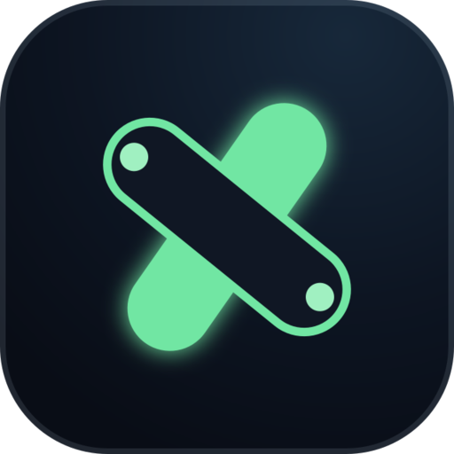
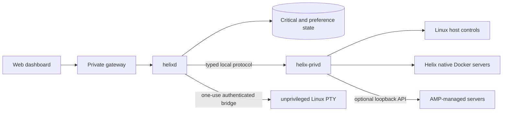

<p align="center">
  
</p>

<h1 align="center">Helix</h1>

<p align="center">
  A local-first Linux dashboard for the host, its files, and independently managed game servers.
</p>

<p align="center">
  <a href="https://github.com/Riqqqque/Helix/actions/workflows/ci.yml"></a>
  
  
  <a href="LICENSE"></a>
</p>

> [!CAUTION]
> Helix is a private alpha, not a supported public release. Keep it on a
> network you control. Do not expose it directly to the public internet or
> trust it as the only copy of important data. Read [PROGRESS.md](PROGRESS.md)
> before relying on a control.

## What Helix is

Helix combines a responsive web dashboard, an unprivileged Rust service, and a
narrow typed Linux broker. It gives the browser useful host controls without
turning the dashboard into a general root shell.

The current private-alpha build includes:

- local owner setup, Argon2id password login, revocable sessions, CSRF
  protection, and owner username/password changes;
- live CPU, memory, swap, disk, network, service, process, and Helix-only
  resource views;
- multiple named Home layouts with drag-and-drop/resizable clock, host, server,
  storage, weather, paged-note, and website-shortcut widgets, per-widget color,
  and JSON export/import;
- mounted-drive browsing, bounded text editing, folder/file creation, rename,
  recoverable deletion, and cancellable largest-file/folder analysis inside
  configured storage roots;
- separate views for private/public addresses, local listeners, Docker port
  publications, UFW state, game-port mappings, router-confirmed UPnP mappings,
  CGNAT, and still-unverified outside reachability;
- narrowly scoped, named UFW allow rules with exact Helix ownership metadata,
  verified deletion, and bounded Undo when UFW is available and active;
- APT/dpkg inventory, explicit package-list refresh, and an exact selected-
  candidate update job with held-package, disk, no-removal simulation, conffile,
  final-version, and never-auto-reboot guards;
- native Docker-backed Minecraft instances for Paper, Purpur, Folia, Fabric,
  Vanilla, and a guarded local custom-JAR import, plus a compatibility-aware
  Modrinth plugin/mod marketplace and a narrow Fabric-only “Start with a
  modpack” path;
- bounded per-game port pools with collision-safe automatic allocation, plus
  exact opt-in Minecraft TCP forwarding on compatible same-LAN UPnP routers;
- start, stop, restart, confirmed native kill when stop hangs, update, backup,
  settings, files, performance, logs, and console tools for native instances;
- bounded persistent native console history that survives browser closes and
  spans retained server boots;
- recoverable native backup deletion and explicit restart-required metadata on
  settings;
- optional AMP discovery/control through a separate loopback integration. AMP
  remains its own manager; Helix does not relabel AMP instances as native;
- a Hooks page for bounded discovery and verified lifecycle control of AMP,
  Plex, Tailscale, Pterodactyl Wings, Jellyfin, and root-configured systemd
  services, with exact one-click Tailscale/Jellyfin APT installs on eligible
  Debian/Ubuntu hosts and a prerequisite-aware Wings guide;
- an optional real Linux PTY that runs as one configured unprivileged host
  user, requires the current Helix password for every one-use connection, and
  does not record commands or output;
- exact Helix dashboard/gateway start-on-boot controls and a scheduled,
  cancellable immediate or recurring host reboot flow with hostname, timezone,
  workload, and disruption checks; and
- a responsive Preact UI with reorderable navigation, System, Midnight, OLED,
  and Light themes, and bounded custom accent/surface/text colors.

These paths have typed protocol, API, and portable/mock coverage. The complete
supported-Ubuntu lifecycle, fault, firewall, package, game-version, and
marketplace matrices are still release gates. See
[the verified state](PROGRESS.md) for the distinction between implemented and
validated.

## Run it

There is no supported binary installer. Use the source:

1. **Loopback preview** on the machine you cloned — owner setup, Home, and
   read-only dashboard pages. Host controls stay unavailable until the Linux
   broker is configured.
2. **Private LAN on a Linux server** — copy `.env.example` to `.env` and
   `deploy/privd.example.json` to the host broker config, then replace every
   placeholder with *that* host's address, groups, and storage roots.

The walkthrough is [Getting Started](docs/wiki/Getting-Started.md). The exact
Compose and systemd boundary is
[Container deployment](docs/CONTAINER-DEPLOYMENT.md).

## Honest limits

Helix does not currently:

- bypass CGNAT/ISP policy, configure routers without compatible UPnP, expose the
  dashboard publicly, or prove game-port reachability from an outside network;
- disable or reset UFW, or change its default policies. A separate confirmed
  activation flow can enable an installed inactive UFW only after preserving a
  verified listening SSH port;
- perform broad unattended upgrades or claim package rollback. Only exact
  selected APT candidates are supported and Linux never reboots automatically;
- update itself from Git, GitHub, or an unsigned artifact;
- authenticate a Tailscale account or silently change tailnet policy. On an
  eligible Debian/Ubuntu host, Hooks can install the exact `tailscale` package
  from Tailscale's signed repository and verify `tailscaled`; the owner still
  runs `tailscale up` and approves the machine;
- provide a supported Forge, NeoForge, Quilt, CurseForge, or broad/full-parity
  modpack workflow;
- provide MFA, a public-network security review, or a signed release channel;
- run third-party Strands; or
- replace independent backups and restore drills.

Helix self-update stays disabled until the backend can stage and verify a signed
release, preserve configuration/data, health-check, and roll back the exact
deployment. Selected APT updates are supported but deliberately make no rollback
claim. Unsupported states are shown as unsupported rather than rendered as
successful no-ops.

## How it fits together



`helixd` stays unprivileged. `helix-privd` accepts a closed set of typed
operations, validates configured roots and exact object identities, and has no
general root-shell RPC. Native game workloads are Docker containers and keep
running when the dashboard is closed. AMP workloads remain owned by AMP. The
optional terminal is a separate non-root service and ends its PTY when the
browser disconnects.

Read [How Helix works](docs/HOW-HELIX-WORKS.md) for the longer walkthrough.

## Private network access

The development service defaults to loopback. The container deployment supports
an explicitly configured private-LAN gateway and an optional second private
entry point suitable for Tailscale routing. Hooks can install and start the
exact Tailscale service on eligible Debian/Ubuntu hosts, but it does not log in,
approve a machine, choose a tailnet, or widen gateway trust. “Tailscale-
compatible” is not a claim that remote access was configured or audited.

A public domain is not required for a private deployment. Public exposure of
the Helix dashboard is not supported by this alpha. Opt-in native-game TCP
forwarding is a separate, narrowly owned UPnP feature and never widens the
dashboard gateway. See
[Container deployment](docs/CONTAINER-DEPLOYMENT.md) for the exact boundary.

## Minecraft scope

The native manager currently exposes install paths for Paper, Purpur, Folia,
Fabric, Vanilla, and an owner-supplied custom server JAR already inside a
configured Storage root. The custom flow copies and hashes the JAR into a
private unprivileged container workspace, pins Java 17, 21, or 25, and never
modifies the source. Helix cannot verify the custom JAR's publisher or select a
future update for it. Deployments that browse broadly from `/` must configure
one or more narrower native `custom_artifact_roots`; Helix never promotes a
whole-host read boundary into an executable import boundary. The Modrinth
marketplace filters content by the selected server software, loader, and
Minecraft version. A missing or negative Modrinth server-side flag is shown as
a warning instead of hiding the project or blocking its install; Helix still
prevents plugin/mod mixing and writes only to the matching `plugins/` or `mods/`
directory. Unsupported server software does not get a fake install path.

NeoForge and Forge appear only as explained future catalog entries. Broad
modpack creation is not a supported claim, but one narrow path is implemented:
“Start with a modpack” can create a stable, server-capable Fabric release from
an unambiguous Modrinth `.mrpack`. The broker re-resolves the opaque project and
version IDs, pins Minecraft and Fabric Loader, verifies the Modrinth-declared
archive SHA-512 plus index-declared file hashes, excludes server-optional and
client-only files, and rolls back an incomplete new instance. The result is
explicitly a server-safe subset, not byte-for-byte pack parity.

Forge, NeoForge, Quilt, unknown loaders, and CurseForge remain preview-only or
unsupported. The archive/parser/API/frontend paths have portable tests; the
complete Linux extraction/resolver/Docker lifecycle, upstream, and real-pack
matrix remains a release gate.

Helix manages servers; it does not execute Minecraft ticks or sit in the player
traffic path. Capacity still depends on hardware, world behavior, server build,
mods/plugins, and configuration. See
[Game hosting capacity](docs/GAME-HOSTING-CAPACITY.md).

The server chooser also reserves a clear V Rising entry rather than pretending
it works on Linux. Stunlock's current dedicated-server distribution is
Windows-only, so a Linux one-click path remains disabled until a reviewed Wine
lifecycle can be installed, updated, backed up, and rolled back safely.

## Make a Strand

A Strand is Helix's planned extension unit. The current Strand Kit can scaffold
and validate a manifest-only preview project:

```text
helixctl strand new system-health --name "System Health" --publisher "Your name"
helixctl strand check system-health
```

The preview starts with no permissions and cannot be installed or executed by
Helix. See [Building a Strand](docs/STRAND-DEVELOPMENT.md).

## Build the source

There is no supported binary release. Maintainers can run the checked source
gates with:

```text
cargo fmt --all -- --check
cargo clippy --locked --workspace --all-targets --all-features -- -D warnings
cargo test --locked --workspace --all-targets --all-features

cd frontend
npm ci --no-audit --no-fund
npm run check
```

Building the web service alone does not configure the Linux broker or grant
host authority. Use disposable data and follow [Development](docs/DEVELOPMENT.md)
or [Container deployment](docs/CONTAINER-DEPLOYMENT.md).

## Repository guide

| Path | Responsibility |
| --- | --- |
| `crates/helixd` | Unprivileged daemon composition and lifecycle |
| `crates/helix-api` | HTTP, authentication, capability, and broker boundaries |
| `crates/helix-privd` | Narrow Linux broker, native manager, AMP bridge, storage, network, and host controls |
| `crates/helix-terminal` | Framed unprivileged PTY bridge for the optional Linux terminal |
| `crates/helix-state` | Critical SQLite state, preferences, migrations, backups, and integrity |
| `crates/helix-auth` | Identity, password, session, and token primitives |
| `crates/helix-strand-kit` | Non-executing Strand preview scaffolding and validation |
| `crates/helix-system` | Bounded read-only host discovery |
| `frontend` | Preact UI, adapters, responsive styling, and tests |
| `deploy` / `compose.yaml` | Private-alpha Linux broker and container examples |
| `docs` | Architecture, security, API, recovery, and operator notes |

Useful starting points:

- [Wiki](https://github.com/Riqqqque/Helix/wiki) — operator-facing documentation
- [Progress](PROGRESS.md) — what is implemented and what remains unvalidated
- [Next work](NEXT.md) — the current validation and implementation order
- [Roadmap](ROADMAP.md) — longer-term sequencing
- [API contract](docs/API.md) — implemented HTTP surface and safety rules
- [Security model](docs/SECURITY.md) — current boundaries and remaining gates
- [Security policy](SECURITY.md) — vulnerability reporting

## License

Helix is versioned as `0.1.0-alpha.1` and licensed under the
[GNU Affero General Public License v3.0 or later](LICENSE).

Public source availability does not mean production support, stable
compatibility, or a completed security review. If you modify Helix and let users
interact with that modified version over a network, the AGPL requires offering
those users the corresponding source under the same terms.

Copyright © 2026 Rique.
