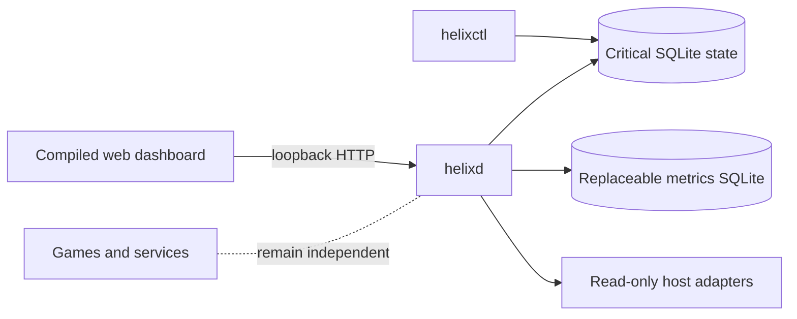

<p align="center">
  
</p>

<h1 align="center">Helix</h1>

<p align="center">
  A local-first Linux server dashboard engineered to stay small, recover cleanly, and tell the truth about what it can do.
</p>

<p align="center">
  <a href="https://github.com/Riqqqque/Helix/actions/workflows/ci.yml"></a>
  
  
  
</p>

> [!CAUTION]
> Helix is an alpha engineering preview, not a supported production control
> plane. It currently binds to loopback only. Do not expose it through a proxy,
> entrust it with irreplaceable data, or treat planned server-management features
> as implemented. See [the exact verified state](PROGRESS.md) before using it.

## What works today

The current build is a real, compiled dashboard foundation rather than a mock UI:

- one-time local owner setup, Argon2id password login, revocable sessions, and
  session-bound CSRF protection;
- a protected overview of CPU, memory, swap, storage, network, uptime, OS,
  architecture, and kernel data;
- separate durable critical-state and replaceable metrics SQLite databases;
- migration snapshots, integrity checks, unclean-shutdown detection, verified
  online state backup, and an exclusive daemon lease;
- `helixctl` `status`, `doctor`, `ready`, `setup-token`, and `backup-state`
  commands;
- a responsive Preact interface with System, Midnight, OLED, and Light themes;
- scripts for a checksummed Linux bundle, transactional package-file install,
  rollback, and conservative data-preserving uninstall. One scoped Ubuntu 24.04
  systemd lifecycle passed for commit [`fdbbc0a`](https://github.com/Riqqqque/Helix/commit/fdbbc0aeb7b353069c74fe5186d1d48fd65b66ca),
  but the broader support matrix remains open and these are not a supported
  installer.

Not implemented yet: remote access, TLS/proxy trust, MFA, host mutation, service
or game management, file management, restore, Vault, Genome, Strands, and the
broader automation roadmap. Helix never renders a successful fake control for an
unfinished backend.

## How it fits together



`helixd` is unprivileged. Managed workloads are intended to remain independent
systemd units, so restarting the dashboard must not stop a game. Future privileged
operations belong behind a narrow typed broker—not a general root shell.

## Try the development preview

There is no supported installer or binary release yet. The only current trial
path is a source build with disposable data on a machine you control.

The commands below are maintainer/developer notes for evaluating the current
source. They do not grant a license or create a supported distribution path; see
[Project and legal status](#project-and-legal-status).

Prerequisites:

- Rust 1.88 or newer;
- Node.js 22.12 or newer and npm;
- a current browser.

Build from the repository root:

```text
cd frontend
npm ci --no-audit --no-fund
npm run build
cd ..

cargo build --locked --release --workspace --all-features
```

Use an explicit disposable data directory and the compiled frontend. In a Bash
shell, for example (this does not imply support for that host platform):

```bash
mkdir -p .helix-data/development

./target/release/helixctl \
  --data-dir "$(pwd)/.helix-data/development" \
  setup-token

./target/release/helixd \
  --listen 127.0.0.1:8080 \
  --data-dir "$(pwd)/.helix-data/development" \
  --web-root "$(pwd)/frontend/dist"
```

Open `http://127.0.0.1:8080`, paste the one-time token, and create the owner.
The token is displayed once and expires after 15 minutes. Never paste it into an
issue, log, screenshot, or shell history shared with someone else.

On later runs with the same data directory, start `helixd` directly;
`setup-token` is only for an unclaimed installation. Press `Ctrl+C` in the daemon
terminal for a clean source-preview shutdown.

On Windows PowerShell, the equivalent launch uses resolved absolute paths:

```powershell
$dataRoot = (New-Item -ItemType Directory -Force '.helix-data\development').FullName
$webRoot = (Resolve-Path 'frontend\dist').Path

.\target\release\helixctl.exe --data-dir $dataRoot setup-token
.\target\release\helixd.exe `
  --listen 127.0.0.1:8080 `
  --data-dir $dataRoot `
  --web-root $webRoot
```

This source-run path is for an isolated preview. The exact scope and limits of
the hosted Ubuntu package evidence are documented in
[Installation](docs/INSTALLATION.md).

## Engineering promises

Helix treats four questions as release requirements for every feature:

| Question | Current discipline |
| --- | --- |
| Is it safe? | Strict inputs, least privilege, bounded work, default deny, and explicit threat models |
| Is it fast? | Measured binary, bundle, startup, idle, and API budgets rather than adjectives |
| Is it recoverable? | Verified snapshots, fail-closed migrations, durable state, and rollback plans |
| Is it quiet when unused? | Optional features must add no timer, poll, child process, or heavyweight runtime while disabled |

The latest non-reference Windows snapshot and the still-blocked Ubuntu reference
protocol are in [Performance](docs/PERFORMANCE.md).

## Repository guide

| Path | Responsibility |
| --- | --- |
| `crates/helixd` | Daemon composition and lifecycle |
| `crates/helixctl` | Local administration and diagnostics |
| `crates/helix-api` | HTTP boundaries, authentication wiring, and middleware |
| `crates/helix-state` | Critical SQLite state, migrations, backups, and integrity |
| `crates/helix-auth` | Identity, password, and opaque-token primitives |
| `crates/helix-secrets` | Portable encrypted-record boundary; production key delivery remains gated |
| `crates/helix-system` | Bounded read-only host discovery |
| `frontend` | Preact, TypeScript, styling, tests, and compiled assets |
| `packaging` / `scripts` | systemd assets and checked local bundle lifecycle |
| `docs` | Architecture, security, recovery, storage, API, and performance contracts |

Start here depending on what you need:

- **I want the short guided version.** [Guided docs](docs/wiki/Home.md) and the
  [project wiki](https://github.com/Riqqqque/Helix/wiki)
- **What is genuinely finished?** [Progress](PROGRESS.md)
- **What should be built next?** [Next work](NEXT.md) and [Roadmap](ROADMAP.md)
- **How can I help?** [Contribution policy](CONTRIBUTING.md) and
  [Development](docs/DEVELOPMENT.md). Code contributions are paused until a
  license is selected; reports, design discussion, and review remain welcome.
- **How are releases gated?** [Release process](docs/RELEASING.md)
- **How is data protected?** [Security model](docs/SECURITY.md),
  [Storage](docs/STORAGE.md), and [Recovery](docs/RECOVERY.md)
- **What does the API expose?** [API contract](docs/API.md)
- **How should I report a vulnerability?** [Security policy](SECURITY.md)

## Project and legal status

The current source is versioned as `0.1.0-alpha.1`. Public source availability
does not mean production support, stable compatibility, or a completed security
review.

No license has been selected. Until the owner makes that legal choice, the
absence of a license means no permission to copy, modify, or redistribute the
source is granted by default.
