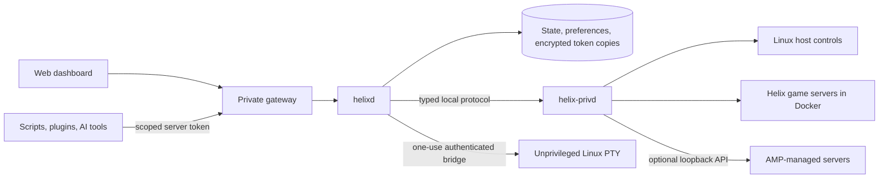

<p align="center">
  
</p>

<h1 align="center">Helix</h1>

<p align="center">
  <strong>One private dashboard for your Linux host, its storage, and your game servers.</strong>
</p>

<p align="center">
  <a href="https://github.com/Riqqqque/Helix/actions/workflows/ci.yml?query=branch%3Amain"></a>
  <a href="https://github.com/Riqqqque/Helix/releases/latest"></a>
  
  
  <a href="LICENSE"></a>
</p>

<p align="center">
  <a href="#install">Install</a> ·
  <a href="https://github.com/Riqqqque/Helix/wiki">User guide</a> ·
  <a href="https://github.com/Riqqqque/Helix/wiki/Servers-and-Marketplace">Game servers</a> ·
  <a href="https://github.com/Riqqqque/Helix/wiki/Server-API-Tokens">Automation and AI</a> ·
  <a href="https://github.com/Riqqqque/Helix/releases">Releases</a> ·
  <a href="PROGRESS.md">What is verified</a>
</p>

> [!CAUTION]
> Helix is a private-LAN release, not a supported public-internet product. Keep
> it on a network you control, do not expose the dashboard directly to the
> internet, and do not treat it as the only copy of important data. Read
> [PROGRESS.md](PROGRESS.md) for what is verified and what is not.

## What Helix is

Helix runs your game servers, watches your host, finds what is filling a drive,
and keeps the everyday controls for one Linux machine in a single fast web
dashboard. It pairs a responsive Preact interface with an unprivileged Rust
service and a narrow, typed Linux broker, so useful host controls never turn the
browser into a root shell.

Game servers run as isolated Docker containers under their own numeric users.
They keep running when the dashboard is closed, and every risky change — a
software update, a restore, a copy between servers — takes a verified backup
first and restores it automatically if the server does not come back.

## Highlights

### Game servers

- **Minecraft** on Paper, Purpur, Folia, Leaves, Pufferfish, Fabric, Quilt,
  Forge, NeoForge, Vanilla, [Pumpkin](https://github.com/Riqqqque/Helix/wiki/Pumpkin),
  or your own JAR, with Modrinth and CurseForge plugins, mods, and
  [modpack servers](https://github.com/Riqqqque/Helix/wiki/Servers-and-Marketplace#marketplace).
- **[Hytale](https://github.com/Riqqqque/Helix/wiki/Hytale)**,
  **[Valheim](https://github.com/Riqqqque/Helix/wiki/Valheim)**, V Rising,
  Terraria and tModLoader, Palworld, Satisfactory, Project Zomboid, 7 Days to
  Die, Rust, Sons of the Forest, Factorio, Don't Starve Together, and Vintage
  Story, each with its own ports, settings, and backups.
- **Console, logs, files, settings, and performance** for every server, with
  console history that survives browser closes and restarts.
- **Server software updates** in three plain choices — update build, change
  version, or repair files — each behind a full backup with automatic rollback.
- **Ports that match the game.** Extra ports for voice chat, web maps, or
  Bedrock players come with presets for the software you run, and collision-safe
  port pools pick free numbers automatically.
- **Backups** with keep rules, recoverable deletion, a trash that shows its size,
  and one-click emptying when you choose.
- **[Copy a setup between servers](https://github.com/Riqqqque/Helix/wiki/Copying-Between-Servers)**
  — promote a finished test server to your public one: plugins and their
  settings, mods, configuration, datapacks, and optionally worlds. Player data
  stays where it is unless you ask for it.
- **[Bring servers in from AMP or Pterodactyl](https://github.com/Riqqqque/Helix/wiki/Server-Migration)**
  with the same Minecraft version, the same port, and the same add-on ports, so
  players join exactly as before.

### Automation and AI

- **[Server API tokens](https://github.com/Riqqqque/Helix/wiki/Server-API-Tokens)**
  scoped to exact servers, with a one-click **Full access** option, expiry you
  choose (including never), and **View token** to see a token again after
  confirming your password.
- Tokens can run everything a server needs — files and uploads, console,
  lifecycle, settings, updates, backups, marketplace installs, and transfers —
  and never reach host controls.
- A documented [OpenAPI contract](docs/openapi.json), a Python client, and an
  audit trail for every token call.

### Host, storage, and network

- Live CPU, memory, disk, network, process, service, Docker, and Helix views,
  plus a Security center that explains each protection before you change it.
- Storage browsing, text editing, recoverable deletion, and cancellable
  largest-file and largest-folder analysis inside the roots you configure.
- Safe Docker cleanup (build cache, dangling images, unused networks) on demand
  or on a schedule — never containers, volumes, or named images.
- Private and public addresses, listeners, Docker publications, UFW state with
  exact Helix-owned rules and Undo, and plain router-forwarding instructions.
- Selected APT updates with held-package, disk, and no-removal guards, scheduled
  or recurring host reboots with workload checks, and a **SHA-256-pinned Helix
  updater** that rebuilds from a published release without touching game
  containers.

### Your dashboard

- Multiple named Home layouts with drag-and-drop, resizable widgets for the
  clock, host, graphs, servers, storage, Docker, weather, notes, shortcuts, and
  the globe, plus export and import.
- Hooks for Plex, Tailscale, Jellyfin, Pterodactyl Wings, Docker, Portainer, and
  systemd services, with exact one-click installs on eligible Debian and Ubuntu
  hosts.
- An optional non-root Linux terminal that asks for your password for every
  session and records nothing.
- [Strands](https://github.com/Riqqqque/Helix/wiki/Building-Strands): shareable
  `.strand.zip` pages and widgets that run isolated and call only what they
  declare.
- System, Midnight, OLED, and Light themes with custom colors, and preferences
  that follow you between browsers.

## Install

Helix is made for a headless Linux server. SSH in and run one command:

```bash
curl -fsSL https://raw.githubusercontent.com/Riqqqque/Helix/main/scripts/install.sh | sudo bash
```

The installer checks the server, offers to install Docker if it is missing,
downloads the latest release and verifies its SHA-256 checksum, detects the
server's private address, writes every setting, builds and starts Helix, and
finishes with:

```text
Helix is running.

  Open http://192.168.1.50:3100 from any computer on 192.168.1.0/24.
  One-time owner setup token: …
```

Open that address from your laptop, paste the token, and create your login.

**You need** a 64-bit Linux server (x86_64 or ARM64) with systemd, Docker Engine
with the Compose plugin (or let the installer add it), a private network address,
and about 10 GB of disk and 4 GB of RAM for the first build. No Rust, Node.js, or
desktop on the server — everything builds inside Docker. Tested on fresh Ubuntu
22.04 and 24.04 machines in CI.

Useful options, passed after `| sudo bash -s --`:

| Option | Use it to |
| --- | --- |
| `--yes` | Install without questions (cloud-init, Ansible, provisioning scripts) |
| `--storage /mnt/media` | Let Helix browse and manage another folder; repeatable |
| `--lan-ip`, `--cidr`, `--port` | Override the detected address, client network, or port 3100 |
| `--terminal-user USER` | Turn on the in-browser terminal for an existing login |
| `--install-docker`, `--open-firewall` | Pre-approve installing Docker and the UFW rule |
| `--check` | Diagnose an install: Docker, broker, containers, and the dashboard address |
| `--uninstall` | Remove Helix but keep game servers, worlds, and backups |

Re-running the installer repairs or upgrades in place and keeps your data. After
that, update from **Host → Update Helix** in the dashboard: it rebuilds Helix and
its host broker from the pinned release, health-checks, rolls back on failure,
and leaves game servers running. The full walkthrough, including Tailscale for
access away from home, is in
[Getting Started](https://github.com/Riqqqque/Helix/wiki/Getting-Started).

### Other ways to run it

- **Manual deployment** — every step the installer performs, for operators who
  want to review or customise each piece:
  [Container deployment](docs/CONTAINER-DEPLOYMENT.md).
- **Dashboard only** — `./scripts/install-from-source.sh` from a clone installs
  the web service on loopback without game servers or host controls.
- **Loopback preview** from a local `cargo`/`npm` build on Windows, macOS, or
  Linux, for development.

## How it fits together


```mermaid
flowchart LR
  Browser[Web dashboard] --> Gateway[Private gateway]
  Tools[Scripts, plugins, AI tools] -->|scoped server token| Gateway
  Gateway --> Daemon[helixd]
  Daemon --> State[(State, preferences, encrypted token copies)]
  Daemon -->|typed local protocol| Broker[helix-privd]
  Daemon -->|one-use authenticated bridge| Terminal[Unprivileged Linux PTY]
  Broker --> Host[Linux host controls]
  Broker --> Native[Helix game servers in Docker]
  Broker -->|optional loopback API| AMP[AMP-managed servers]
```

`helixd` stays unprivileged. `helix-privd` accepts a closed set of typed
operations, checks configured roots and exact object identities, writes inside
server folders without following links, and has no general root-shell call.
Read [How Helix works](https://github.com/Riqqqque/Helix/wiki/How-Helix-Works)
for the longer walkthrough and [Security](docs/SECURITY.md) for the boundaries.

## Honest limits

Helix does not currently:

- expose the dashboard publicly, bypass CGNAT, configure routers without
  compatible UPnP, or prove a game port is reachable from outside;
- disable or reset UFW, or change its default policies;
- perform broad unattended upgrades or promise package rollback — only exact,
  selected APT candidates, and Linux never reboots on its own;
- sign its release artifacts independently; the updater verifies the published
  SHA-256 checksum of a numbered GitHub release;
- sign in to Tailscale for you, copy a full client modpack, or use CurseForge
  without your own API key;
- provide MFA or a public-network security review;
- run portable Wasm Strands or native Strand sidecars; or
- replace independent, off-host backups and restore drills.

Unsupported states are shown as unsupported instead of pretending to succeed.

## Build from source

```text
cargo fmt --all -- --check
cargo clippy --locked --workspace --all-targets --all-features -- -D warnings
cargo test --locked --workspace --all-targets --all-features

cd frontend
npm ci --no-audit --no-fund
npm run check
```

Building the web service alone does not configure the broker or grant host
authority. Use disposable data and follow [Development](docs/DEVELOPMENT.md) or
[Container deployment](docs/CONTAINER-DEPLOYMENT.md).

## Repository guide

| Path | Responsibility |
| --- | --- |
| `crates/helixd` | Unprivileged daemon composition and lifecycle |
| `crates/helix-api` | HTTP, authentication, capabilities, server tokens, and broker calls |
| `crates/helix-privd` | Typed Linux broker: game servers, transfers, AMP bridge, storage, network, and host controls |
| `crates/helix-terminal` | Framed unprivileged PTY bridge for the optional terminal |
| `crates/helix-state` | SQLite state, preferences, migrations, backups, and integrity |
| `crates/helix-secrets` | Envelope encryption for secrets kept at rest |
| `crates/helix-auth` | Identity, password, session, and token primitives |
| `crates/helix-strand-kit` | Strand scaffolding, packing, and validation |
| `crates/helix-system` | Bounded read-only host discovery |
| `frontend` | Preact UI, adapters, styling, and tests |
| `deploy` / `compose.yaml` | Private-LAN broker and container deployment |
| `docs` | Architecture, security, API, recovery, and operator guides |

Useful starting points:

- [Wiki](https://github.com/Riqqqque/Helix/wiki) — the operator guide
- [Changelog](CHANGELOG.md) — what changed in each release
- [Progress](PROGRESS.md) — what is implemented and what is verified
- [Server tokens](docs/SERVER-TOKENS.md) and [API contract](docs/API.md)
- [Security model](docs/SECURITY.md) and [security policy](SECURITY.md)
- [Roadmap](ROADMAP.md) and [next work](NEXT.md)

## License

Helix is versioned as `1.9.0` and licensed under the
[GNU Affero General Public License v3.0 or later](LICENSE).

Public source availability does not mean production support, stable
compatibility, or a completed security review. If you modify Helix and let users
interact with that modified version over a network, the AGPL requires offering
those users the corresponding source under the same terms.

Copyright © 2026 Rique.
