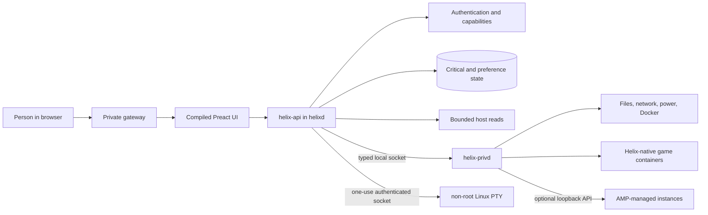

# How Helix Works

## The short version

Helix is one private control center for a Linux server. The dashboard shows the
host, storage, network evidence, services, files, and game servers without
placing the web process in the game or player traffic path.

The current build is Helix 1.0, a private-LAN release, not a public-internet
product. Its authentication,
modular Home page, typed Linux broker, native Minecraft manager, separate AMP
bridge, persistent console history, recoverable backups, and bounded host
controls are real. Complete supported-host, fault, recovery, security, and game
version matrices are still open.

## A request through Helix

1. `helixd` starts as an unprivileged process, opens its local state, and serves
   the compiled frontend and versioned API.
2. Login creates a bounded revocable session. Protected requests require the
   session cookie, an in-memory session-bound CSRF proof, and the capability for
   that operation.
3. Read-only adapters collect bounded host data. The browser never reads the
   host directly.
4. Root-required work is serialized into a closed `BrokerRequest` enum and sent
   over a length-bounded Unix socket to `helix-privd`.
5. The broker revalidates configured roots, opaque IDs, exact container names,
   current state, and operation limits. It cannot accept a caller-supplied shell
   command.
6. Results return as bounded JSON with explicit denied, degraded, unavailable,
   stale, conflict, and failure states.

The optional terminal is not a root-broker command. After a fresh Helix password
check, the browser receives a one-use 30-second HttpOnly ticket and opens one
exact WebSocket protocol. `helixd` bridges it to a separate service running as
the configured Linux user. The socket group is distinct from the broker group,
Linux peer credentials must match the pinned dashboard UID, and disconnect kills
the PTY. Helix records lifecycle events, not commands or output. Tab stays in
the shell so bash can complete the way it does over SSH.

The private gateway is optional for a loopback development preview and required
by the checked container layout for private-LAN access. It validates an exact
Host, Origin, and client CIDR. Helix does not provide a reviewed public-internet
boundary.

## Native servers and AMP

Helix-native Minecraft instances run in Docker containers managed by the
broker. Current native install paths cover Paper, Purpur, Folia, Leaves, Fabric, and
Vanilla. V Rising uses a separate Helix-owned isolated runtime image rather than
installing Wine on the host. New V Rising servers list on the in-game browser
by default. Direct Connect to a public IP still needs the UDP game and query
ports. The manager provides creation, lifecycle actions,
settings where they exist, files, performance, console or logs, updates,
backups, restore, a start-after-boot choice, and compatible
Modrinth or CurseForge content where the selected software supports it. If you
use CurseForge, this host needs a normal ISP IP; VPS and VPN exits are often
blocked. Each server can use a
compact preset, a game mark, or a validated same-origin uploaded PNG/JPEG icon.

“Start with a modpack” is a separate narrow creation path. Search can explain
all loaders, but creation accepts only listed stable server-capable Fabric
releases with one unambiguous Modrinth `.mrpack`. The broker re-resolves opaque
IDs, verifies the Modrinth-declared archive SHA-512 and index-declared file
hashes, pins Minecraft/Fabric Loader, rejects unsafe archive entries, and
activates fresh staging only after validation. Optional server and client-only
files are excluded and counted, so the result is a server-safe subset rather
than byte-for-byte full-pack parity.

Closing the browser or restarting the dashboard does not stop a native game
container. Console capture writes protected rotating archive segments instead
of trusting browser memory. History pages are cursor-based and bounded, so
“persistent” means retained across browser closes and server boots, not
permanent or unlimited.

Per-instance guards serialize incompatible work. Creation, update, backup, and
marketplace installs expose background job status, but current job state lives
for the broker process lifetime and is not yet a crash-persistent queue. Native
kill is a confirmed SIGKILL that can run beside a hung stop or restart; it is
not offered for AMP.

AMP is not the native runtime. When configured, Helix reaches a separately
protected loopback AMP API and exposes only the AMP operations it understands.
Idle/sleep in AMP is the game hibernating, not Helix calling the instance
online. AMP remains responsible for its own identities, files, credentials, and
lifecycle semantics. Helix will not rewrite AMP instance files or steal a live
AMP game port; it names the instance and the AMP clicks to change the port, or
it can delete a leftover AMP-described UPnP mapping after an exact confirmation
when no instance still lists that number. An unavailable or ambiguous AMP
response fails closed.

## Host, storage, network, and updates

Configured-root storage tools provide directory browsing, bounded text
read/write, creation, rename, recoverable trash, and cancellable largest-item
analysis. These are not an arbitrary root-filesystem API.

The Network page keeps four different facts separate: a local listener, Docker
publication and bind, UFW allowance, and externally tested reachability.
External reachability is currently unverified. Helix can create, delete, and
restore exact Helix-owned UFW allow rules only when UFW is active and verified.
A separate confirmed activation flow can preserve a verified listening SSH TCP
port before enabling an installed inactive UFW. Helix never resets or changes
UFW defaults and cannot open a router.

Start-on-boot changes only the exact configured Helix dashboard and gateway
container restart policies. Immediate host reboot requires exact hostname
confirmation, acknowledgement, workload preflight, a 10–300 second delay, and
a cancellable systemd timer. Recurring daily/weekday schedules use the verified
host timezone and the same safety checks. Native game containers cannot be
started, stopped, or restarted from the Docker inventory page; Servers uses a
45-second stop and a health check.

Opening the package page is read-only. Package-list refresh and exact selected-
candidate Apply are separate confirmed jobs. Apply revalidates versions, holds,
disk headroom, a no-removal/no-new-package preview, conffile policy, and final
installed versions. It does not claim rollback or reboot automatically. Helix
self-update can apply a SHA-256-pinned GitHub source archive to the dashboard,
gateway, and broker, then roll those back if health-check fails. `git pull` is
not used. Game containers are not replaced.

## Home and future Strands

Home is a built-in modular dashboard. Multiple named layouts can be created,
duplicated, switched, exported, imported, and removed. Clock, host, server,
storage, weather, paged-note, HTTP(S) shortcut, and Globe widgets can be added, dragged,
resized in both dimensions, renamed, recolored, and removed. Globe is also a
full page that starts hidden; add it from Arrange. Notes can opt into
quick editing outside layout mode. Layouts are bounded revisioned preferences
with a local retry copy and are included in critical-state backups.

Hooks is the built-in integration catalog. It detects exact allowlisted Plex,
Tailscale, Pterodactyl Wings, and Jellyfin systemd services plus the AMP API
adapter, exposes only verified supported lifecycle actions, and links to the
upstream panel for deeper settings. An absent service receives guided official
setup instead of an unsafe remote install script or a fake connected state.

Strands are installable UI-only extensions. An owner can drop someone else's
`.strand.zip` onto the Strands page, review the exact host calls, and Enable it.
The package runs in a sandboxed iframe and may call bounded metrics, its own
key/value store, and allowlisted HTTPS APIs. Portable Wasm and native sidecars
are not a runtime. Built-in Home modularity is separate from Strands; a Home
widget can embed an enabled Strand that declared `helix:ui.widget`.

## Data and recovery

Helix separates critical state from replaceable telemetry and caches. Native
instance definitions, console archives, worlds, and backups live under explicit
broker-managed roots rather than trusting display names as paths.

Critical-state snapshots and integrity checks exist. Native backups can be
created and restored; deleting a known backup moves it into protected
recoverable trash with an opaque identity and Undo metadata. Removed native
servers work the same way until you delete them forever from Removed and hidden.
This is not a substitute for an independent off-host copy or a clean-machine
restore drill.

## Why this design is appealing

- **Useful without hiding Linux:** beginners get clear defaults and preflight;
  experienced operators still see ports, services, processes, versions,
  revisions, and failure reasons.
- **Games are not held hostage by the panel:** the control plane is outside the
  game process and player network path.
- **The interface stays focused:** large or optional surfaces are lazy-loaded,
  lists and history are bounded, and refresh cadence is configurable.
- **Risky controls are narrow:** root authority crosses typed operations with
  exact identities. The optional general shell runs separately as a normal
  Linux user and needs a fresh password proof per connection.
- **Unsupported remains unsupported:** independently signed Helix keys, outside reachability,
  public exposure, third-party Strand execution, and unimplemented
  server/content combinations are not presented as success.

Helix is not a game engine, hypervisor, Kubernetes replacement, or hosted SaaS.
It coordinates one Linux host. Read [Progress](../PROGRESS.md) for current
evidence, [Roadmap](../ROADMAP.md) for sequencing, and
[Game Hosting Capacity](GAME-HOSTING-CAPACITY.md) for the boundary between
control-plane scale and real player capacity.
