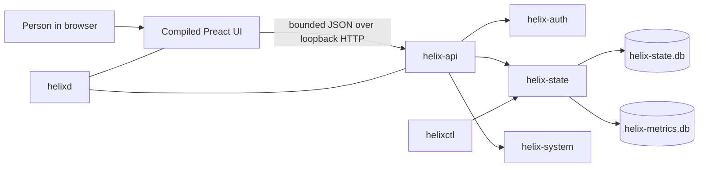
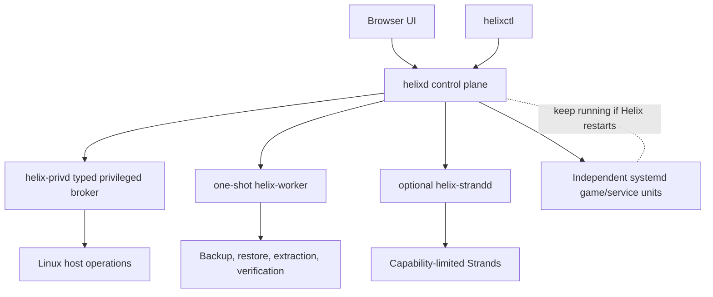

# How Helix Works

## The short version

Helix is meant to be one small control center for a Linux server. You open a
fast local web dashboard to see the machine, manage services and game servers,
schedule work, protect data, and diagnose failures. The managed workloads stay
independent, so losing the dashboard does not kill a running game.

Today, Helix is an alpha foundation: authentication, durable local state,
read-only host monitoring, recovery checks, a compiled dashboard, administrative
CLI, packaging tests, and preview Strand developer tooling are real. Most host
mutation and game-management features remain roadmap work.

## A request through the current app

1. `helixd` starts as the small, unprivileged control-plane daemon.
2. It opens the durable state database, obtains an exclusive installation
   lease, validates schema and shutdown state, and serves the compiled frontend.
3. The browser calls versioned HTTP endpoints. Authentication, CSRF, request
   size, concurrency, timeout, and response policies are enforced at the API
   boundary.
4. Read-only host adapters collect bounded CPU, memory, disk, network, OS, and
   uptime data. The browser never reads the host directly.
5. Important identity and configuration data uses the durable database.
   Replaceable telemetry uses a separate metrics database with different
   recovery rules.
6. `helixctl` handles local setup, health checks, readiness, verified state
   snapshots, and developer tooling without turning the web API into a root
   administration endpoint.

The frontend is built ahead of time and embedded or served as static files.
Node.js is a build dependency, not a production-server dependency.

## How future control will work

- **Ordinary orchestration** stays in `helixd`.
- **Root-required changes** go through `helix-privd` as narrow typed
  operations. There is no generic “run this string as root” API.
- **Expensive jobs** run in one-shot workers with CPU, memory, I/O, timeout, and
  cancellation limits.
- **Game servers and services** run as independent systemd units. Helix manages
  them but is not their fragile parent process.
- **Strands** run in a separate optional host with explicit permissions and
  quotas. If none are enabled, the heavyweight runtime costs nothing.
- **Sequences** will describe safe, repeatable game installation and lifecycle
  steps as typed data rather than downloadable shell scripts.
- **Vault** will coordinate verified backups. **Genome** will describe and
  rebuild an installation after loss.

## The data model

Helix separates data by consequence:

- `helix-state.db` holds accounts, permissions, sessions, configuration,
  jobs, instance definitions, audit records, and other state that must survive.
  It uses SQLite WAL mode with full durability and verified migrations.
- `helix-metrics.db` holds replaceable telemetry. Corrupt metrics must never
  block administration or destroy critical state.
- Large worlds, server files, archives, and backups stay on the filesystem in
  explicit storage pools. Display names never become trusted paths.
- Recoverable secrets use authenticated encryption. The production master-key
  delivery and recovery design remains a release gate.

Important operations that cross SQLite and the filesystem will use a durable
operation ledger so a crash can be reconciled rather than leaving an unknown
half-applied change.

## What makes Helix appealing

### It is quiet when unused

The base goal is one small resident daemon. No database server, Redis, Node,
Python, Java, container runtime, reverse proxy, or Wasm engine is required just
to show the dashboard. Optional systems should add no polling loop or resident
memory until enabled.

### It does not hold games hostage

Many panels become part of the process tree or network path they manage. Helix
is deliberately a control plane. Restarting its UI, daemon, worker, or extension
host should not terminate an independent game server.

### It serves beginners without trapping experts

A beginner should get safe defaults, previews, plain permission explanations,
and guided recovery. An expert should still see exact paths, units, limits,
ports, provenance, configuration revisions, and audit history instead of a
simplified black box.

### It treats recovery as a feature

“Backup completed” is weaker than “a clean machine was restored and verified.”
Helix's design keeps checksums, manifests, rollback material, database
snapshots, and restore drills in the normal product rather than leaving
recovery to hope.

### It has a constrained extension story

Strands are intended to make the product expandable without loading arbitrary
native libraries into the daemon. Authors declare what they need; operators
review it; the host enforces it; and the extension can fail without taking the
server panel or games down.

### It earns performance claims

The dashboard has automated compressed-payload budgets, APIs have bounded work,
metrics adapt to demand, and performance documentation records measurements
separately from targets. “Lightweight” is a result Helix must keep proving.

## What Helix is not

Helix is not a game engine, hypervisor, container orchestrator, hosted SaaS, or
replacement for Linux. It coordinates the operating system's mature primitives
and gives them one understandable interface.

It is also not production-ready today. Read [Progress](../PROGRESS.md) for exact
evidence, [Roadmap](../ROADMAP.md) for sequencing, and
[Game Hosting Capacity](GAME-HOSTING-CAPACITY.md) for the boundary between
control-plane scale and actual player capacity.
