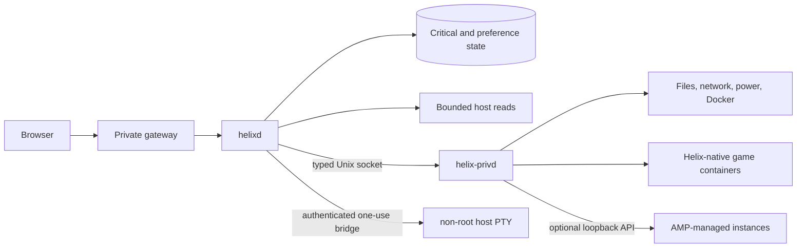

# Architecture

Helix separates the browser, unprivileged web service, privileged host boundary,
and managed workloads.

- `helixd` serves the compiled Preact interface, authenticates requests, checks
  capabilities, and remains unprivileged.
- `helix-privd` accepts a closed, length-bounded protocol. It has no general
  shell RPC and revalidates configured roots and exact object identities.
- The optional terminal is a separate Linux-user service with a distinct socket
  group and kernel peer-UID check. It never runs inside the root broker.
- Critical SQLite state is kept separate from replaceable metrics and caches.
- Native Minecraft instances are Docker containers managed through the broker.
  They keep running when the browser or dashboard closes.
- AMP is optional, loopback-only, and remains a separate manager with its own
  instances, files, and credentials.
- Long or risky operations use bounded jobs and per-instance concurrency
  guards. Current broker job status is not a crash-persistent queue.
- Home widgets are built into Helix. An enabled Strand that declared
  `helix:ui.widget` can also be pinned as a Home widget. UI-only Strands install
  from an owner-authorized zip; portable Wasm is not a runtime.

Network evidence deliberately keeps a local listener, Docker publication, UFW
allowance, and outside reachability separate. A green value in one layer does
not prove the next layer is reachable.

Detailed contracts:

- [API](https://github.com/Riqqqque/Helix/blob/main/docs/API.md)
- [Security](https://github.com/Riqqqque/Helix/blob/main/docs/SECURITY.md)
- [How Helix Works](https://github.com/Riqqqque/Helix/blob/main/docs/HOW-HELIX-WORKS.md)
- [Storage](https://github.com/Riqqqque/Helix/blob/main/docs/STORAGE.md)
