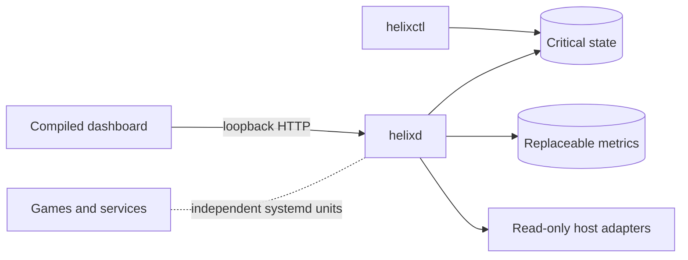

# Architecture

Helix separates the web control plane from the workloads it will eventually
manage.

- `helixd` is the unprivileged API and static-asset daemon.
- `helixctl` performs local diagnostics, readiness, setup, and verified backup.
- Critical state uses SQLite WAL with `synchronous=FULL`.
- Replaceable metrics use a separate SQLite durability domain.
- Host discovery is bounded, read-only, and sampled only on demand.
- Future privileged mutations must use a narrow typed broker, never a general
  root shell.
- Games and services must survive a Helix dashboard restart or upgrade.

Detailed contracts:

- [Architecture](https://github.com/Riqqqque/Helix/blob/main/docs/ARCHITECTURE.md)
- [API](https://github.com/Riqqqque/Helix/blob/main/docs/API.md)
- [Storage](https://github.com/Riqqqque/Helix/blob/main/docs/STORAGE.md)
- [Architecture decisions](https://github.com/Riqqqque/Helix/tree/main/docs/adr)
